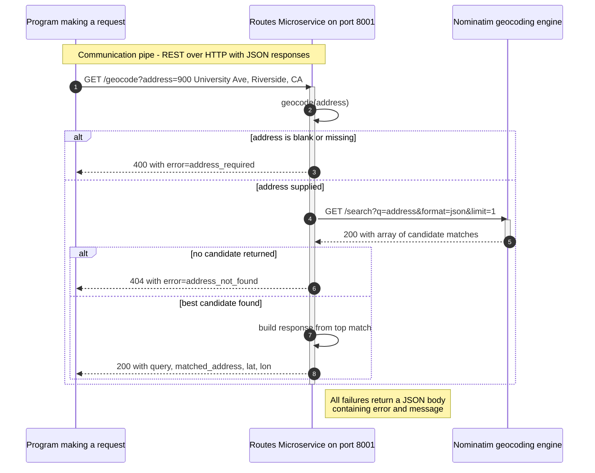

# Geocoding Microservice

## A. Geocoding Microservice Description
This microservice converts text addresses into geographic coordinates with a latitude and longitude

**Prerequisities:** Requires a running Novinatum geocoding engine. https://nominatim.org/

The usage of the public instance can be limited, so recommend installing your own engine locally with OpenStreetMap data for your desired region. Docker image can be found at the following repo, and can be set up by running the following terminal commands from the project directory

https://github.com/Suvamp/cs361-main-program
```
# 1. Fetch and clip OpenStreetMap data (~1 GB download, one-time), currently pulls data for Southern California Inland Empire, can modify to your use case
./scripts/fetch_data.sh

# 2. Start up the nominatum engine, valhalla too if you intend on doing routing test
docker compose up -d --build valhalla nominatim
```


## B. Requesting Data from the microservice
Send a HTTP GET request to the microservice, with the address you want to geocode in string format as the query parameter "address".

**Base URL:** http://localhost:8001

**Endpoint:** /geocode

**Method:** GET

Query Parameters:
| **Parameter** | **Type**   | **Required** | **Description**                          |
|-----------|--------|----------|---------------------------------------|
| `address` | string | Yes      | street address to geocode  |

**Example call:**
```
import requests

BASE_URL = "http://localhost:8001"

# Request 1: geocode an address
geo_response = requests.get(
    f"{BASE_URL}/geocode",
    params={"address": "900 University Ave, Riverside, CA"},
    timeout=10,
)
```

## C. Receiving Data from the microservice
Microservice responds with JSON. On success returns HTTP 200 with the matched address and its coordinates. On error will return an error code and a message. Refer to table below for details.<br>
<br>
**Successful response:**
| **Field** | **Type**  | **Description** |
|-----------|--------|----------|
| `query` | string     | the address as it was sent |
| `matched_address` | string | the address the Nominatum engine matched to from the available OpenStreetMap dataset  |
| `lat` | float | Latitude in degrees  |
| `lon` | float | Longitude in degrees |

**Example success response:**
```
{
  "query": "900 University Ave, Riverside, CA",
  "matched_address": "900 University Ave, Riverside, CA 92521, USA",
  "lat": 33.9737,
  "lon": -117.3281
}
```

**Error responses:**
| **Status Codes** | **Type**  | **Description** |
|-----------|--------|----------|
| `400` | address_required     | missing/blank address  |
| `404` | address_not found    | no match found for address entered  |
| `502` | geocoder_unavailable    | the Nominatum geocoding engine is unreachable  |

**Example error response:**
```
{
  "error": "address_not_found",
  "message": "No coordinates could be found for 'abcdefghijklm'."
}
```

## D. UML sequence diagram




